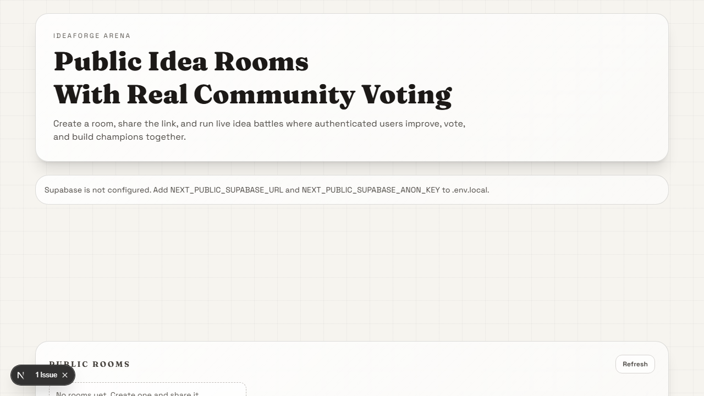

# IdeaForge Arena

Turn raw ideas into community-polished concepts in minutes.

## Screenshot



IdeaForge Arena now includes:

1. Supabase authentication (magic link email sign-in).
2. Real multi-user A/B voting stored in Postgres.
3. Shareable public room URLs (`/room/<slug>`).
4. Timed rounds, champion progression, evolution timeline, leaderboard.

## Migration Checklist

Use this whenever you pull new changes in this repository.

For a fresh Supabase project:

1. Run `supabase/setup.sql` in Supabase SQL Editor.
2. Set Authentication -> URL Configuration with both localhost and production URLs.
3. Set `NEXT_PUBLIC_SUPABASE_URL` and `NEXT_PUBLIC_SUPABASE_ANON_KEY` in your app environment.

For an existing Supabase project already in use:

1. Run `supabase/add-rls-policies.sql` in Supabase SQL Editor.
2. Verify `ideas_update` policy allows signed-in collaborators (used by rounds/champion updates).
3. Confirm Authentication redirect settings include both local and production origins.

## Deploy To Vercel

[](https://vercel.com/new/clone?repository-url=https://github.com/vivs-ty/ideaforge-arena&env=NEXT_PUBLIC_SUPABASE_URL,NEXT_PUBLIC_SUPABASE_ANON_KEY&envDescription=Supabase%20project%20URL%20and%20anon%20key)

## Stack

- Next.js 16
- React 19
- TypeScript
- Tailwind CSS 4
- Supabase (Auth + Postgres)

## Local Setup

1. Install dependencies.

```bash
npm install
```

2. Create your local environment file.

```bash
cp .env.example .env.local
```

3. Add values in `.env.local`:

```env
NEXT_PUBLIC_SUPABASE_URL=...
NEXT_PUBLIC_SUPABASE_ANON_KEY=...
```

4. In Supabase SQL Editor, run `supabase/setup.sql`.

5. If your Supabase project already existed before these policy updates, also run `supabase/add-rls-policies.sql` once to refresh RLS policies.

6. Run the app.

```bash
npm run dev
```

Open http://localhost:3000.

## Supabase Auth Settings

In your Supabase project:

1. Go to Authentication -> URL Configuration.
2. Set Site URL to your primary app URL.
3. Add redirect URLs for local and production:

- `http://localhost:3000`
- `https://<your-vercel-domain>`

Magic-link sign-in uses these URLs for return flow.

Important: send the magic link from the same origin you want to sign into.

- If you request a link on localhost, the email may return to localhost.
- If you request a link on production, the email should return to production.

This app uses `window.location.origin` for `emailRedirectTo`, so origin mismatches can keep you signed out on the domain where you are trying to create rooms.

## Production Env On Vercel

In Vercel Project Settings -> Environment Variables, add:

- `NEXT_PUBLIC_SUPABASE_URL`
- `NEXT_PUBLIC_SUPABASE_ANON_KEY`

Then redeploy.

## Room Sharing

- Create a room from the homepage.
- Share the generated room URL (`/room/<slug>`).
- Anyone can view; authenticated users can post and vote.

## Troubleshooting

### "Unable to create room"

- Confirm your page shows "Signed in as ...".
- Confirm `NEXT_PUBLIC_SUPABASE_URL` and `NEXT_PUBLIC_SUPABASE_ANON_KEY` exist in local `.env.local` and in Vercel env vars for production.
- Confirm Supabase Authentication URL Configuration includes both localhost and production redirect URLs.

### "Ideas section not working" (start round / submit challenger / champion updates)

- Run `supabase/add-rls-policies.sql` in Supabase SQL Editor.
- The app expects authenticated users to be able to update ideas during collaborative rounds.
- If buttons are disabled, check the helper text in the UI for the exact unlock condition.

## Build

```bash
npm run build
npm run start
```
